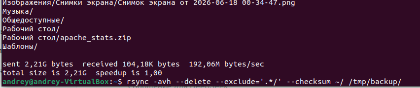

# Домашнее задание: «Резервное копирование»

**Студент:** Калинин Андрей

---

## Задание 1. Составьте команду rsync, которая позволяет создавать зеркальную копию домашней директории пользователя в директорию /tmp/backup

скриншот с командой и результатом ее выполнения:

## Задание 2. Написать скрипт и настроить задачу на регулярное резервное копирование домашней директории пользователя с помощью rsync и cron.

Файл конфигурации Crontab:

